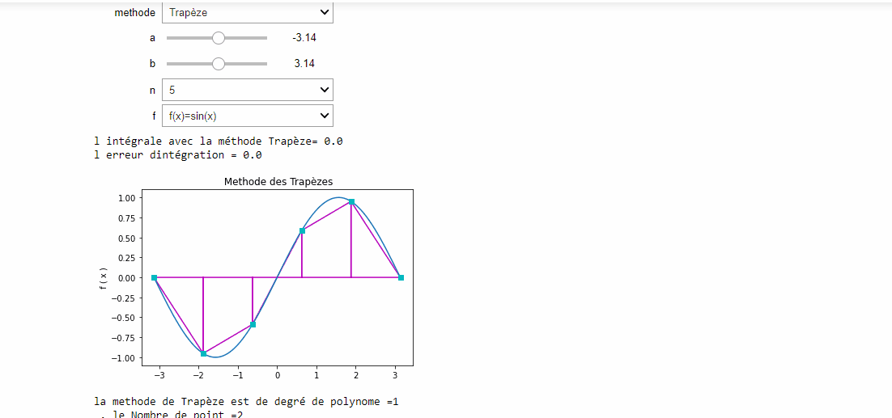

# TP3 Interpolation Numérique 
 NUM_ANALYSIS

<!-- START doctoc generated TOC please keep comment here to allow auto update -->
<!-- DON'T EDIT THIS SECTION, INSTEAD RE-RUN doctoc TO UPDATE -->

- [Requirements](#requirements)
- [Getting started](#getting-started)

<!-- END doctoc generated TOC please keep comment here to allow auto update -->

## Requirements

* [ANACONDA For windows ]
* [Octave]
* [Jupyter]

## Getting started 
>Dans le TP3: nous avons découvert intégration numérique
><ul>nous avons développé avec python les methodes
  <li>Trapèze
    <li>Rectangle
      <li>Point Milieu
        <li>Simpson
  </ul>

